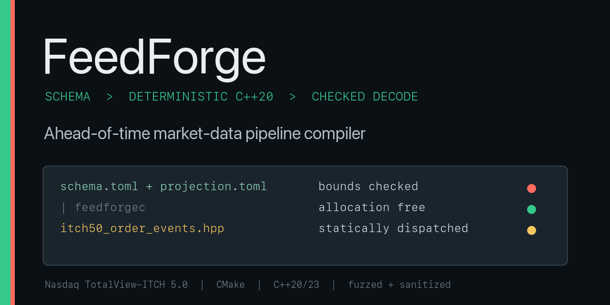
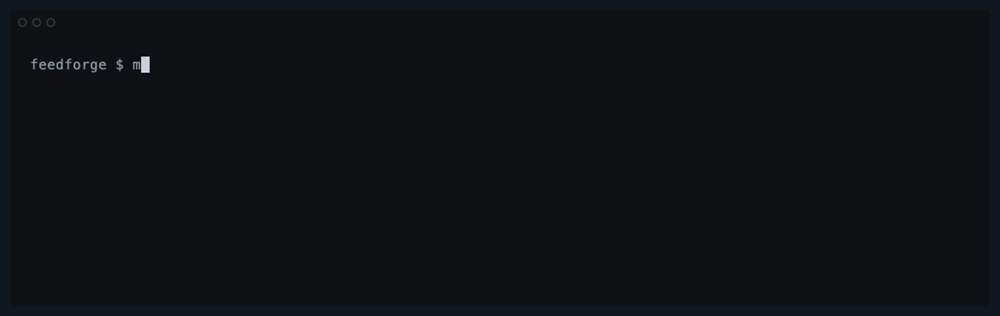
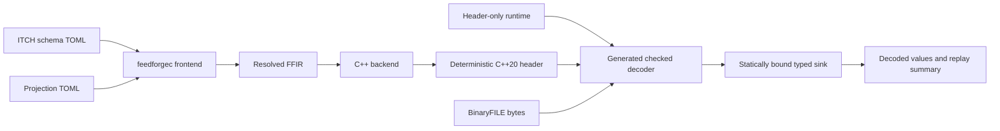

# FeedForge

[](https://github.com/uburuntu/FeedForge/actions/workflows/ci.yml)
[](https://github.com/uburuntu/FeedForge/actions/workflows/fuzz-smoke.yml)
[](https://github.com/uburuntu/FeedForge/actions/workflows/codeql.yml)
[](https://github.com/uburuntu/FeedForge/releases/latest)
[](LICENSE)



FeedForge is an ahead-of-time compiler for checked market-data decode
pipelines. Its scope is deliberately narrow: compile a declarative
Nasdaq TotalView-ITCH 5.0 projection into strict C++20, then replay Nasdaq
BinaryFILE data through a statically bound sink.

FeedForge v0.3.0 is an **offline checked decoder**, not a feed handler or trading
platform. It is experimental, is not exchange-certified, and is not production
trading infrastructure.

## From schema to decoded events

Run the self-contained showcase with a C++20 compiler, CMake, and Ninja:

```sh
make demo
```



The path is concrete: the audited
[`totalview_itch_5_0.toml`](schemas/nasdaq/totalview_itch_5_0.toml) schema and
[`order_events.toml`](pipelines/order_events.toml) projection produce the
committed
[`itch50_order_events.hpp`](generated/include/feedforge/generated/nasdaq/itch50_order_events.hpp)
C++20 header, which
[`synthetic_order_events.cpp`](examples/synthetic_order_events.cpp) invokes.

The demo replays an embedded, format-valid synthetic BinaryFILE session. It
contains no captured or licensed exchange data. The projection selects three
order events from four input frames; the generated decoder validates and skips
the unselected system event before delivering typed C++ values:

```text
FeedForge synthetic order-event showcase
source=embedded format-valid synthetic bytes; no captured exchange data
event=add_order order=1001 side=buy shares=250 stock=FFORGE price=185.2500 timestamp_ns=1000000
event=order_executed order=1001 executed_shares=100 match=9001 timestamp_ns=1000500
event=order_replace old_order=1001 new_order=1002 shares=150 price=185.3000 timestamp_ns=1001000
summary status=complete frames=4 emitted=3 known_skipped=1 bytes=124
```

At runtime there is no schema parsing or dynamic dispatch. FeedForge-owned work
on the per-message decode path remains allocation-free; console output belongs
to the demo sink.



## Measured specialization

The generated decoder contains four retained structural optimizations evaluated
under a frozen benchmark contract. On one recorded Apple M4 Max/AppleClang
configuration, all three predeclared synthetic targets cleared their 5% median
and 3% uncertainty-adjusted acceptance thresholds:

| Predeclared target | Median reduction in ns/message |
|---|---:|
| All-message `decode_one` | 22.75% |
| Order-event mixed `decode_one` | 7.34% |
| Known-unselected order-event replay | 44.67% |

These are comparative microbenchmark results, not feed latency or production
throughput claims. The [performance case study](docs/performance-case-study.md)
publishes all eight guarded cases, rejected hypotheses, code-size cost,
environment limits, content IDs, and the redacted holdout conclusion.

## Scope

FeedForge v0.3 provides:

- a header-only C++20 runtime exposed as `FeedForge::runtime`;
- a C++23 host compiler exposed as `FeedForge::compiler`;
- deterministic generation of self-contained pipeline headers;
- explicit runtime API epoch/revision compatibility and 64-bit replay offsets;
- bounded schema and pipeline compilation with stable diagnostics;
- portable, bounds-checked one-shot and caller-buffered chunked BinaryFILE
  decoding;
- an independently transcribed differential decode oracle and seven libFuzzer
  targets spanning the runtime and compiler frontends; and
- allocation-free FeedForge-owned work on the per-message decode path.

| Surface | Contract |
|---|---|
| Runtime and generated code | Strict C++20; GCC 11 or Clang 14 minimum |
| Host compiler | C++23; GCC 13.2, Clang 17, or MSVC 19.38 (Visual Studio 2022 17.8), with a matching standard library |
| Platform policy | Linux x86-64 Tier 1; macOS arm64 and Windows x64 Tier 2; emulated s390x big-endian probe |
| Protocol scope | Nasdaq TotalView-ITCH 5.0 over in-memory BinaryFILE |
| Delivery | Statically bound typed sinks with explicit stop/error outcomes |

Live networking, packet recovery, order-book reconstruction, strategy logic,
and runtime schema parsing are outside the project boundary. See
[Architecture](docs/architecture.md) for component boundaries and deliberate
limits.

## Requirements

- CMake 3.25 or newer;
- Ninja for the shared project presets;
- a C++20 compiler for the runtime and generated code; and
- a supported C++23 compiler and standard library when building `feedforgec`.

The project has no external runtime dependency. On POSIX development hosts,
GNU Make is an optional source-tree command catalog; consumers and native
Windows developers continue to use CMake directly.

## Build and test

The default Make target lists the available development workflows. Start with
the environment check and focused suite:

```sh
make
make doctor
make quick
```

Use `make dev` for the full Debug suite and generated-byte check, `make release`
for an optimized build, `make sanitizers` for ASan+UBSan, and `make fuzz-smoke`
for bounded local libFuzzer runs. The wrapper delegates to the shared CMake
presets; direct CMake commands remain documented in
[the development workflow](docs/development.md).

To configure only the C++20 runtime without requiring a C++23 host toolchain:

```sh
cmake -S . -B build/runtime \
  -DFEEDFORGE_BUILD_COMPILER=OFF \
  -DFEEDFORGE_BUILD_TESTS=OFF \
  -DFEEDFORGE_BUILD_EXAMPLES=OFF
cmake --build build/runtime
```

## Generate and replay

The maintainer verification flow builds the host compiler, regenerates the two
canonical headers from their audited schema and pipelines, checks them
byte-for-byte, and builds the order-events replay example:

```sh
make generated-refresh CONFIRM=regenerate
make dev
make replay-empty
```

`generated-refresh` is explicitly guarded because it rewrites committed source;
ordinary builds and installs never do so. `replay-empty` uses
`itch50_order_events` against a valid empty complete session and reports
`status=complete` with two bytes consumed. Use `make replay REPLAY_FILE=<path>`
for a BinaryFILE you are permitted to process. The example reports exact replay
status, counters, consumed bytes, and framing or decode error category, and
performs file I/O and input allocation before entering replay.

To generate a one-off header under the build tree instead:

```sh
make pipeline-compile \
  GENERATED_OUTPUT=build/manual/itch50_order_events.hpp
```

## CMake consumers

Install FeedForge into a prefix:

```sh
make install PREFIX=build/install
```

Then consume the runtime and either committed canonical pipeline from a
separate CMake project:

```cmake
find_package(FeedForge CONFIG REQUIRED)
target_link_libraries(
  my_decoder
  PRIVATE
    FeedForge::generated::itch50_order_events
)
```

When the compiler is installed, `feedforge_generate()` creates a generated
interface target without writing into the source tree:

```cmake
feedforge_generate(
  NAME order_events
  SCHEMA nasdaq_totalview_itch_5_0
  PIPELINE "${CMAKE_CURRENT_SOURCE_DIR}/order_events.toml"
)

target_link_libraries(
  my_decoder
  PRIVATE FeedForge::generated::order_events
)
```

The committed targets are `FeedForge::generated::itch50_all` and
`FeedForge::generated::itch50_order_events`. They remain available in a
runtime-only install configured with `FEEDFORGE_BUILD_COMPILER=OFF`; this path
requires neither C++23 nor toml++. Custom generation requires an install that
contains `FeedForge::compiler`.

FeedForge v0.3 processes caller-provided Nasdaq BinaryFILE byte spans only. It does not
provide live networking, recovery, order-book reconstruction, exchange
certification, or production-trading guarantees.

## Documentation

- [Architecture](docs/architecture.md)
- [Compatibility](docs/compatibility.md)
- [Compiler CLI](docs/compiler-cli.md)
- [Compiler limits](docs/compiler-limits.md)
- [Security model](docs/security-model.md)
- [Development workflow](docs/development.md)
- [Adoption and integration guide](docs/adoption.md)
- [Schema format](docs/schema-format.md)
- [Pipeline format](docs/pipeline-format.md)
- [Generated C++ API](docs/generated-api.md)
- [Testing and fixture provenance](docs/testing.md)
- [Benchmark contract](docs/benchmarking.md)
- [Performance case study](docs/performance-case-study.md)
- [Schema audit](docs/schema-audit.md)
- [v0.3.0 release notes](RELEASE_NOTES.md)

## Contributing and security

See [CONTRIBUTING.md](CONTRIBUTING.md) for development and review expectations.
Please report security-sensitive findings through the private process in
[SECURITY.md](SECURITY.md), not a public issue.

## License

FeedForge is licensed under the Apache License 2.0. See [LICENSE](LICENSE).
